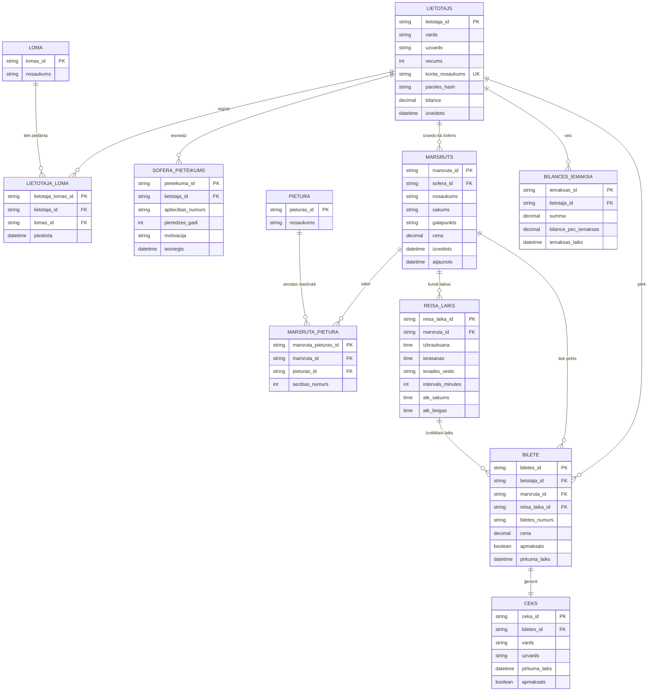

# Autoostas informācijas sistēmas realitāšu-saišu diagramma

## Kardinalitātes

- Viens lietotājs var iegūt vairākas lomas, piemēram, pasažieris, autobusa vadītājs un autoostas vadītājs.
- Viena loma var būt piešķirta daudziem lietotājiem.
- Viens lietotājs var iesniegt vienu vai vairākus šofera pieteikumus.
- Viens autobusa vadītājs var izveidot daudzus maršrutus.
- Vienam maršrutam var būt daudzas pieturas, un viena pietura var būt daudzos maršrutos, tāpēc ir starprealitāte `MARSRUTA_PIETURA`.
- Vienam maršrutam var būt vairāki reisa laiki, gan manuāli ievadīti, gan automātiski atkārtoti pēc intervāla.
- Viens lietotājs var veikt daudzas bilances iemaksas.
- Viens lietotājs var nopirkt daudzas biļetes.
- Viena biļete attiecas uz vienu maršrutu un vienu konkrētu reisa laiku.
- Vienai biļetei tiek ģenerēts viens čeks.

## Piezīme par pārskatiem

Pārskata pogas, piemēram, “Visvairāk iztērēts”, “Visizdevīgākais brauciens”, “Populārākais maršruts”, “Lielākā iemaksa” un “Kopējie ienākumi”, nav atsevišķas glabājamas realitātes. Tie ir aprēķināmi pārskati no `BILETE`, `BILANCES_IEMAKSA`, `LIETOTAJS` un `MARSRUTS` datiem.
