# Autoostas informācijas sistēmas iesniegšanas pārbaude un melnraksti

## Dokumenta mērķis

Šis dokuments pārbauda, vai Autoostas informācijas sistēmas melnraksta dokumentācija atbilst prasītajām iesniedzamajām vienībām. Dokumentā apkopots vienkāršots sistēmas modelis, datu vārdnīca, funkcionālās un nefunkcionālās prasības, testēšanas tabulas, ekvivalences klases, relācijas modelis un wireframe melnraksts.

## 0. Kritēriju pārbaudes saraksts

| Nr. | Prasītā vienība | Statuss | Kur dokumentā atrodams |
|---|---|---|---|
| 1 | Sistēmas vienkāršots modelis | Izpildīts | 1. nodaļa |
| 1.1 | Modeļa objekti | Izpildīts | 1.1. nodaļa |
| 1.2 | Modeļa objektu saites un apraksti | Izpildīts | 1.2. nodaļa |
| 2 | Datu vārdnīca | Izpildīts | 2. nodaļa |
| 3 | Funkcionālās prasības, vismaz 10 | Izpildīts | 3. nodaļa, 15 prasības |
| 4 | Nefunkcionālās prasības | Izpildīts | 4. nodaļa |
| 4.1 | Procesa nefunkcionālās prasības, vismaz 3 | Izpildīts | 4.1. nodaļa |
| 4.2 | Produkta nefunkcionālās prasības, vismaz 3 | Izpildīts | 4.2. nodaļa |
| 4.3 | Ārējās nefunkcionālās prasības, vismaz 1 | Izpildīts | 4.3. nodaļa |
| 4.4 | Nefunkcionālās prasības 5 funkcijām | Izpildīts | 4.4. nodaļa |
| 5 | Funkcionālo prasību testēšanas tabula | Izpildīts | 5.1. nodaļa |
| 6 | Nefunkcionālo prasību testēšanas tabula | Izpildīts | 5.2. nodaļa |
| 7 | Ekvivalences klases | Izpildīts | 6. nodaļa |
| 8 | Relācijas modelis melnrakstā | Izpildīts | 7. nodaļa |
| 9 | Wireframe melnraksts | Izpildīts | 8. nodaļa |

## 1. Sistēmas vienkāršots modelis

Autoostas informācijas sistēma ir tīmekļa lietotne ar trīs galvenām daļām: lietotāja interfeisu, servera API un SQLite datu bāzi. Sistēmu izmanto viesis, pasažieris, autobusa vadītājs un autoostas vadītājs.

```mermaid
flowchart LR
  Viesis["Viesis"] --> UI["Tīmekļa lietotne"]
  Pasazieris["Pasažieris"] --> UI
  Soferis["Autobusa vadītājs"] --> UI
  Vaditajs["Autoostas vadītājs"] --> UI
  UI --> API["Python servera API"]
  API --> DB[("SQLite datu bāze")]
  UI --> QR["QR kods un čeks"]
```



### 1.1. Modeļa objekti

| Objekts | Tips | Apraksts |
|---|---|---|
| Viesis | Ārējais lietotājs | Var meklēt maršrutus un atvērt pieteikšanās vai konta izveides logu. |
| Pasažieris | Sistēmas lietotājs | Reģistrēts lietotājs, kurš var papildināt bilanci un pirkt biļetes. |
| Autobusa vadītājs | Sistēmas lietotājs ar lomu | Lietotājs, kurš pēc pieteikuma var veidot un labot maršrutus. |
| Autoostas vadītājs | Sistēmas lietotājs ar pārvaldības lomu | Lietotājs, kurš var skatīt sistēmas datus un pārskatus. |
| Tīmekļa lietotne | Sistēmas daļa | HTML, CSS un JavaScript lapas: sākumlapa, maršruta forma un pārvaldības lapa. |
| Python servera API | Sistēmas daļa | Apkalpo datu pieprasījumus, validē ievades datus un strādā ar SQL datu bāzi. |
| SQLite datu bāze | Datu glabātuve | Glabā lietotājus, maršrutus, pieturas, reisu laikus, iemaksas un biļetes. |
| QR kods un čeks | Izvaddati | Tiek izveidoti pēc veiksmīgas biļetes apmaksas. |

### 1.2. Modeļa objektu saites un to apraksti

| Saite | Kardinalitāte | Apraksts |
|---|---|---|
| Lietotājs - Biļete | 1:N | Viens lietotājs var nopirkt vairākas biļetes, bet viena biļete pieder vienam lietotājam. |
| Lietotājs - Bilances iemaksa | 1:N | Viens lietotājs var veikt vairākas iemaksas, bet viena iemaksa pieder vienam lietotājam. |
| Lietotājs - Šofera pieteikums | 1:N | Lietotājs var iesniegt šofera pieteikumus, pieteikums attiecas uz konkrētu lietotāju. |
| Autobusa vadītājs - Maršruts | 1:N | Viens šoferis var izveidot vairākus maršrutus, maršruts tiek piesaistīts vienam šoferim. |
| Maršruts - Pieturvieta | 1:N | Vienam maršrutam var būt vairākas pieturvietas noteiktā secībā. |
| Maršruts - Reisa laiks | 1:N | Vienam maršrutam var būt vairāki reisa laiki. |
| Maršruts - Biļete | 1:N | Vienam maršrutam var būt vairākas nopirktas biļetes. |
| Tīmekļa lietotne - API | Pieprasījumi | Lietotāja darbības tiek nosūtītas uz serveri kā API pieprasījumi. |
| API - SQLite datu bāze | SQL darbības | Serveris nolasa, pievieno un atjauno datus datu bāzē. |

## 2. Datu vārdnīca

| Datu objekts | Lauks | Tips | Obligāts | Apraksts |
|---|---|---|---|---|
| Lietotājs | `username` | TEXT, PK | Jā | Unikāls konta nosaukums. |
| Lietotājs | `first_name` | TEXT | Jā | Lietotāja vārds. |
| Lietotājs | `last_name` | TEXT | Jā | Lietotāja uzvārds. |
| Lietotājs | `age` | INTEGER | Jā | Vecums no 1 līdz 120. |
| Lietotājs | `password_hash` | TEXT | Jā | Sālīts paroles hash. |
| Lietotājs | `balance` | REAL | Jā | Konta bilance EUR. |
| Lietotājs | `is_driver` | INTEGER | Jā | Vai lietotājs ir autobusa vadītājs. |
| Lietotājs | `is_station_manager` | INTEGER | Jā | Vai lietotājs ir autoostas vadītājs. |
| Šofera pieteikums | `id` | TEXT, PK | Jā | Pieteikuma identifikators. |
| Šofera pieteikums | `username` | TEXT, FK | Jā | Pieteikuma iesniedzējs. |
| Šofera pieteikums | `license_number` | TEXT | Jā | Vadītāja apliecības numurs. |
| Šofera pieteikums | `experience_years` | INTEGER | Jā | Vadītāja pieredze gados. |
| Maršruts | `id` | TEXT, PK | Jā | Maršruta identifikators. |
| Maršruts | `name` | TEXT | Jā | Maršruta nosaukums. |
| Maršruts | `start_point` | TEXT | Jā | Sākumpunkts. |
| Maršruts | `end_point` | TEXT | Jā | Galapunkts. |
| Maršruts | `price` | REAL | Jā | Biļetes cena. |
| Maršruts | `driver_username` | TEXT, FK | Jā | Maršruta izveidotājs. |
| Pieturvieta | `stop_name` | TEXT | Jā | Pieturvietas nosaukums. |
| Pieturvieta | `sequence_number` | INTEGER | Jā | Pieturvietas secība. |
| Reisa laiks | `departure` | TEXT | Jā | Izbraukšanas laiks. |
| Reisa laiks | `arrival` | TEXT | Jā | Ierašanās laiks. |
| Biļete | `ticket_number` | TEXT | Jā | Biļetes numurs čekam un QR kodam. |
| Biļete | `price` | REAL | Jā | Samaksātā cena. |
| Biļete | `paid` | INTEGER | Jā | Vai biļete apmaksāta. |
| Bilances iemaksa | `amount` | REAL | Jā | Iemaksas summa. |
| Bilances iemaksa | `balance_after` | REAL | Jā | Bilance pēc iemaksas. |

Pilnāka datu vārdnīca ir atsevišķā dokumentā `docs/datu-vardnica.md`.

## 3. Funkcionālās prasības

| ID | Funkcionālā prasība | Prioritāte |
|---|---|---|
| F-01 | Sistēmai jāļauj viesim meklēt maršrutus pēc sākumpunkta un galapunkta. | Augsta |
| F-02 | Sistēmai jāparāda atrasto maršrutu nosaukums, pieturas, reisa laiki un cena. | Augsta |
| F-03 | Sistēmai jāļauj izveidot jaunu kontu ar vārdu, uzvārdu, vecumu, konta nosaukumu un paroli. | Augsta |
| F-04 | Sistēmai jānodrošina pieteikšanās ar konta nosaukumu un paroli. | Augsta |
| F-05 | Sistēmai jāļauj pieteikšanās logā parādīt vai paslēpt paroli. | Vidēja |
| F-06 | Sistēmai jāvalidē parole pēc garuma, lielā burta, cipara un speciālā simbola. | Augsta |
| F-07 | Sistēmai jāaizliedz atkārtoti konta nosaukumi. | Augsta |
| F-08 | Sistēmai jāļauj lietotājam papildināt bilanci no 0.01 līdz 200 EUR. | Augsta |
| F-09 | Sistēmai jāparāda lietotāja iepriekšējie biļešu pirkumi. | Vidēja |
| F-10 | Sistēmai jāļauj izvēlēties maršrutu un konkrētu reisa laiku. | Augsta |
| F-11 | Sistēmai jāļauj nopirkt biļeti, ja lietotāja bilance ir pietiekama. | Augsta |
| F-12 | Sistēmai jāparāda kļūda, ja biļetes pirkšanai nepietiek bilances. | Augsta |
| F-13 | Sistēmai pēc biļetes pirkuma jāparāda QR kods un lejupielādējams čeks. | Augsta |
| F-14 | Sistēmai jāļauj lietotājam pieteikties par autobusa vadītāju. | Vidēja |
| F-15 | Sistēmai jāļauj autobusa vadītājam izveidot maršrutu ar pieturām un vairākiem reisa laikiem. | Augsta |

## 4. Nefunkcionālās prasības

### 4.1. Nefunkcionālās prasības procesam

| ID | Prasība | Apraksts |
|---|---|---|
| NP-01 | Izstrādes procesā jāveido dokumentācija | Katram galvenajam projektēšanas rezultātam jābūt dokumentētam: modelim, datu vārdnīcai, prasībām, testiem un wireframe. |
| NP-02 | Izmaiņas jāpārbauda ar testiem | Pēc būtiskām izmaiņām jāpalaiž sintakses pārbaudes un automātiskie testi. |
| NP-03 | Datu bāzes izmaiņas jāapraksta | Tabulas, lauki un saites jāapraksta datu vārdnīcā vai relācijas modelī. |

### 4.2. Nefunkcionālās prasības produktam

| ID | Prasība | Apraksts |
|---|---|---|
| NPr-01 | Lietotāja saskarnei jābūt latviešu valodā | Visi galvenie teksti, pogas un kļūdas jāparāda latviski. |
| NPr-02 | Kļūdu paziņojumiem jābūt redzamiem | Ja ievade ir nepareiza, kļūdai jāparādās pie formas un/vai paziņojumā. |
| NPr-03 | Paroles nedrīkst glabāt atklātā tekstā | Datu bāzē jāglabā tikai paroles hash. |
| NPr-04 | Sistēmai jāstrādā lokāli pārlūkā | Lietotni var palaist ar `python server.py` un atvērt caur `127.0.0.1`. |
| NPr-05 | Datu bāzei jāizmanto primārās un ārējās atslēgas | Saistītie dati jāglabā normalizētās tabulās. |

### 4.3. Ārējās nefunkcionālās prasības

| ID | Prasība | Apraksts |
|---|---|---|
| NA-01 | Sistēmai jāizmanto SQL datu bāze | Projekta dati jāsaglabā SQLite datu bāzē `autoosta.db`, izmantojot SQL shēmu `database/schema.sql`. |
| NA-02 | Sistēmai jābūt darbināmai bez interneta | Projekts ir lokāls mācību projekts, tāpēc pamatfunkcijām nav jābūt atkarīgām no ārējiem tīmekļa pakalpojumiem. |

### 4.4. Nefunkcionālās prasības izvēlētām 5 sistēmas funkcijām

| Funkcija | Nefunkcionālā prasība | Pārbaudes veids |
|---|---|---|
| Konta izveide | Parole jāvalidē klientā un serverī; dati jāglabā SQL datu bāzē. | Mēģināt reģistrēt nederīgu paroli un pārbaudīt DB ierakstu. |
| Pieteikšanās | Nepareizas paroles gadījumā kļūdai jābūt redzamai lietotājam. | Ievadīt nepareizu paroli un pārbaudīt kļūdas tekstu. |
| Bilances papildināšana | Summa drīkst būt tikai virs 0 un līdz 200 EUR. | Testēt robežvērtības: 0, 0.01, 200, 200.01. |
| Biļetes pirkšana | Bilance un biļetes ieraksts jāatjauno vienā servera darbībā. | Pārbaudīt, ka pēc pirkuma bilance samazinās un `purchases` ir ieraksts. |
| Maršruta izveide | Tikai šoferis drīkst saglabāt maršrutu; maršrutam jābūt vismaz vienam reisa laikam. | Mēģināt saglabāt kā parastam lietotājam un kā šoferim ar korektiem datiem. |

## 5. Funkcionālo un nefunkcionālo prasību testēšanas tabulas

### 5.1. Funkcionālo prasību testēšanas tabula

| Testa ID | Prasība | Ievaddati | Sagaidāmais rezultāts | Statuss |
|---|---|---|---|---|
| TF-01 | F-01 | No: `Rīga`, Uz: `Liepāja` | Tiek parādīts vismaz viens atbilstošs maršruts, ja tāds ir DB. | Sagatavots |
| TF-02 | F-03 | Vārds, uzvārds, vecums 18, unikāls konts, `Parole!1` | Konts tiek izveidots un lietotājs tiek pieslēgts. | Sagatavots |
| TF-03 | F-06 | Parole `abc` | Sistēma parāda paroles politikas kļūdu. | Sagatavots |
| TF-04 | F-07 | Reģistrēt kontu ar jau esošu konta nosaukumu | Sistēma aizliedz reģistrāciju. | Sagatavots |
| TF-05 | F-08 | Iemaksa `50.00` | Bilance palielinās par 50 EUR un `top_ups` saglabā ierakstu. | Sagatavots |
| TF-06 | F-08 | Iemaksa `250.00` | Sistēma parāda kļūdu un bilanci nemaina. | Sagatavots |
| TF-07 | F-11 | Izvēlēts maršruts un pietiekama bilance | Biļete tiek nopirkta, parādās QR kods un čeks. | Sagatavots |
| TF-08 | F-12 | Izvēlēts maršruts, bilance zem cenas | Sistēma parāda kļūdu par nepietiekamiem līdzekļiem. | Sagatavots |
| TF-09 | F-14 | Vecums 20, pieredze 3 gadi | Sistēma aizliedz šofera statusu, jo tiesības var būt tikai no 18. | Sagatavots |
| TF-10 | F-15 | Šoferis ievada maršrutu ar 3 pieturām un 2 laikiem | Maršruts, pieturas un laiki saglabājas DB. | Sagatavots |

### 5.2. Nefunkcionālo prasību testēšanas tabula

| Testa ID | Prasība | Pārbaude | Sagaidāmais rezultāts | Statuss |
|---|---|---|---|---|
| TN-01 | NPr-01 | Atvērt galvenās lapas un dialogus | Teksti ir latviešu valodā. | Sagatavots |
| TN-02 | NPr-02 | Ievadīt nederīgu paroli vai summu | Kļūdas teksts ir redzams un saprotams. | Sagatavots |
| TN-03 | NPr-03 | Apskatīt `users.password_hash` datu bāzē | Parole nav atklātā tekstā, bet hash formā. | Sagatavots |
| TN-04 | NPr-04 | Palaist `python server.py 8001` | Lietotne atveras lokāli pārlūkā. | Sagatavots |
| TN-05 | NPr-05 | Pārbaudīt `database/schema.sql` | Tabulām ir PK un FK saites. | Sagatavots |
| TN-06 | NP-02 | Palaist `python -m unittest discover -s tests -v` | Visi automātiskie testi izpildās veiksmīgi. | Izpildīts |
| TN-07 | NA-01 | Veikt reģistrāciju vai biļetes pirkumu | Dati tiek ierakstīti SQLite datu bāzē. | Sagatavots |

## 6. Ekvivalences klases

| Funkcija / lauks | Derīgā ekvivalences klase | Nederīgā ekvivalences klase | Robežvērtības |
|---|---|---|---|
| Vecums reģistrācijā | Vesels skaitlis 1-120 | Tukšs, teksts, 0, negatīvs, virs 120 | 1, 120, 0, 121 |
| Parole | Vismaz 8 simboli, lielais burts, cipars, speciālais simbols | Par īsu, bez lielā burta, bez cipara, bez speciālā simbola | 7 simboli, 8 simboli |
| Konta nosaukums | Netukšs un unikāls | Tukšs vai jau eksistējošs | 1 simbols, esošs konts |
| Bilances papildināšana | 0.01-200.00 EUR | 0, negatīvs, virs 200, teksts | 0, 0.01, 200, 200.01 |
| Biļetes pirkšana | Bilance >= cena | Bilance < cena vai nav izvēlēts maršruts | Bilance tieši vienāda ar cenu; 0.01 zem cenas |
| Šofera pieredze | `vecums - pieredze >= 18` | `vecums - pieredze < 18` | Tieši 18; 17 |
| Maršruta cena | Skaitlis virs 0 | 0, negatīvs, teksts | 0, 0.01 |
| Reisa laiks | Izbraukšana un ierašanās aizpildīta | Tukšs viens no laikiem | Viena laika pāris; tukšs pāris |
| Atkārtošanās intervāls | Pozitīva izvēlētā vērtība minūtēs | 0, negatīva vai nederīga vērtība | 30, 60, 180 |
| Brauciena ilgums | 1-1440 minūtes | 0, negatīvs, virs 1440 | 1, 1440, 1441 |

### Ekvivalences klašu testēšanas tabula

| Testa ID | Ekvivalences klase | Testa dati | Sagaidāmais rezultāts |
|---|---|---|---|
| EK-01 | Derīgs vecums | `18` | Reģistrācijas forma pieņem vecumu. |
| EK-02 | Nederīgs vecums | `0` | Sistēma parāda vecuma kļūdu. |
| EK-03 | Derīga parole | `Parole!1` | Parole tiek pieņemta. |
| EK-04 | Nederīga parole | `parole11` | Sistēma prasa lielo burtu un speciālo simbolu. |
| EK-05 | Derīga iemaksa | `200` | Bilance tiek papildināta. |
| EK-06 | Nederīga iemaksa | `200.01` | Sistēma aizliedz iemaksu. |
| EK-07 | Derīgs šofera pieteikums | Vecums 30, pieredze 10 | Lietotājs var kļūt par šoferi. |
| EK-08 | Nederīgs šofera pieteikums | Vecums 20, pieredze 3 | Sistēma aizliedz, jo tiesības nevarēja būt pirms 18. |
| EK-09 | Derīga maršruta cena | `0.01` | Maršruts var tikt saglabāts. |
| EK-10 | Nederīga maršruta cena | `0` | Sistēma parāda cenas kļūdu. |

## 7. Relācijas modelis melnrakstā

Relācijas modelis balstīts uz SQLite shēmu `database/schema.sql`.

```text
USERS(username PK, first_name, last_name, age, password_hash, balance,
      is_driver, is_station_manager, driver_since, station_manager_since,
      created_at, updated_at)

DRIVER_APPLICATIONS(id PK, username FK -> USERS.username,
      first_name, last_name, license_number, experience_years, motivation, created_at)

ROUTES(id PK, name, start_point, end_point, price,
      driver_username FK -> USERS.username, departure, arrival, schedule_mode,
      recurrence_start_time, recurrence_end_time, recurrence_interval_minutes,
      recurrence_duration_minutes, created_at, updated_at)

ROUTE_STOPS(id PK, route_id FK -> ROUTES.id, stop_name, sequence_number)

ROUTE_SCHEDULES(id PK, route_id FK -> ROUTES.id, departure, arrival, sequence_number)

PURCHASES(id PK, ticket_number, username FK -> USERS.username,
      route_id FK -> ROUTES.id, route_name, start_point, end_point,
      departure, arrival, schedule_id, price, paid, created_at)

TOP_UPS(id PK, username FK -> USERS.username,
      first_name, last_name, amount, balance_after, created_at)
```

### Relāciju saites

| No tabulas | Uz tabulu | Saite | Apraksts |
|---|---|---|---|
| `driver_applications.username` | `users.username` | N:1 | Katrs šofera pieteikums pieder vienam lietotājam. |
| `routes.driver_username` | `users.username` | N:1 | Katru maršrutu izveido viens šoferis. |
| `route_stops.route_id` | `routes.id` | N:1 | Katra pieturvieta pieder vienam maršrutam. |
| `route_schedules.route_id` | `routes.id` | N:1 | Katrs reisa laiks pieder vienam maršrutam. |
| `purchases.username` | `users.username` | N:1 | Katra biļete pieder vienam pircējam. |
| `purchases.route_id` | `routes.id` | N:1 | Katra biļete attiecas uz vienu maršrutu. |
| `top_ups.username` | `users.username` | N:1 | Katra iemaksa pieder vienam lietotājam. |

## 8. Wireframe melnraksts

### 8.1. Sākumlapa

```text
+------------------------------------------------------------------+
| Autoostas informācijas sistēma       [Pieteikties] [Izveidot]    |
|                                                                  |
| No kurienes? [_________________]  Uz kurieni? [________________] |
|                                      [Meklēt] [Rādīt visus]      |
|                                                                  |
| Maršrutu rezultāti                                                |
| [Maršruta kartīte: nosaukums, pieturas, laiki, cena, izvēlēties] |
+------------------------------------------------------------------+
```

### 8.2. Pieteikšanās un konta izveide

```text
+------------------------------+     +-----------------------------------+
| Pieteikties                  |     | Izveidot kontu                    |
| Konta nosaukums [________]   |     | Vārds [____] Uzvārds [____]      |
| Parole [________________]    |     | Vecums [__] Konts [________]     |
| [ ] Parādīt paroli           |     | Parole [____] Atkārtot [____]    |
| [Pieteikties]                |     | [Izveidot kontu]                 |
+------------------------------+     +-----------------------------------+
```

### 8.3. Bilance un biļetes pirkums

```text
+---------------------------------------------------------------+
| Lietotājs: Vārds Uzvārds        Bilance: 25.00 EUR            |
| Izvēlētais maršruts: Rīga - Liepāja                           |
| Laiki: [08:10] [12:10] [16:10]                                |
| Cena: 12.50 EUR                              [Apmaksāt]       |
| Pēc apmaksas: [QR kods] [Lejupielādēt čeku]                   |
+---------------------------------------------------------------+
```

### 8.4. Šofera maršruta izveides lapa

```text
+----------------------------------------------------------------+
| Jauns maršruts                                                  |
| Nosaukums [____________] Cena [____]                            |
| Sākums [______________] Galapunkts [______________]             |
| Pieturas: [________] [-]  [+]  [________] [-]                   |
| Reisa laiki: [Manuāli] [Atkārtojas]                             |
| Manuāli: [08:00] [11:00] [+ Pievienot laiku]                   |
| Atkārtojas: no [08:00] līdz [18:00] ik pēc [1h] ilgums [180]   |
| [Saglabāt maršrutu]                                             |
+----------------------------------------------------------------+
```

### 8.5. Autoostas vadītāja pārvaldības lapa

```text
+----------------------------------------------------------------+
| Autoostas pārvaldība                                            |
| [Visvairāk iztērēts] [Visizdevīgākais brauciens] [Populārākais]|
| [Lielākā iemaksa] [Kopējie ienākumi]                            |
| Lietotāju tabula | Maršrutu tabula | Iemaksas | Biļetes         |
+----------------------------------------------------------------+
```

Pilnāks wireframe apraksts ir dokumentā `docs/lietotaja-interfeisa-wireframe.md`.

## 9. Secinājums

Pēc pārbaudes melnraksta dokumentācija satur visas prasītās iesniedzamās vienības: vienkāršoto sistēmas modeli ar objektiem un saitēm, datu vārdnīcu, funkcionālās un nefunkcionālās prasības, testēšanas tabulas, ekvivalences klases, relācijas modeli un wireframe melnrakstu.
