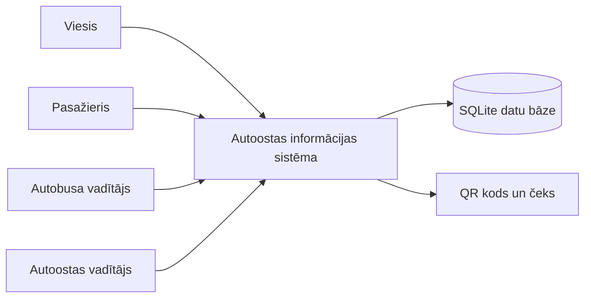
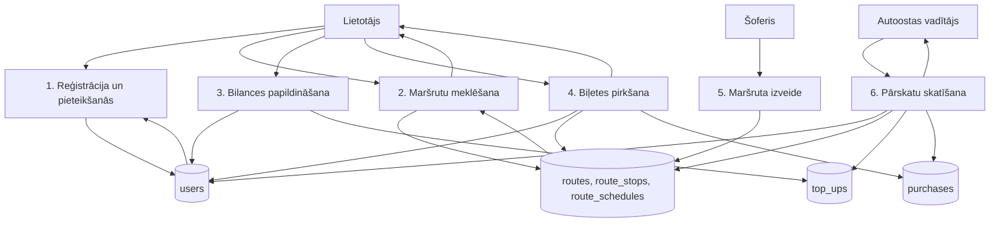

# Autoostas informācijas sistēmas modelis

## Konteksta modelis

## 1. līmeņa datu plūsmas diagramma

## Skatu punkti

| Skatu punkts | Intereses | Sistēmas reakcija |
|---|---|---|
| Viesis | Atrast maršrutu un saprast, vai sistēmu ir vērts lietot | Maršrutu meklēšana bez pieteikšanās |
| Pasažieris | Ērti nopirkt biļeti un redzēt bilanci | Konts, bilance, pirkumi, QR kods, čeks |
| Šoferis | Veidot maršrutus ar vairākiem reisa laikiem | Atsevišķa maršruta izveides/labošanas lapa |
| Autoostas vadītājs | Pārraudzīt sistēmas datus | Pārvaldības panelis un pārskatu pogas |

## Galvenie procesi

### Reģistrācija

Lietotājs ievada vārdu, uzvārdu, vecumu, konta nosaukumu un paroli. Klienta puse pārbauda laukus, serveris vēlreiz pārbauda obligātos laukus, paroles politiku un konta nosaukuma unikalitāti. Ja dati ir korekti, serveris saglabā lietotāju SQL datu bāzē.

### Biļetes pirkšana

Lietotājs izvēlas maršrutu un reisa laiku. Serveris pārbauda lietotāju, maršrutu, reisa laiku un bilanci. Ja naudas pietiek, serveris vienā darbībā samazina bilanci un saglabā pirkumu. Klients parāda QR kodu un čeku.

### Maršruta izveide

Šoferis aizpilda maršruta formu atsevišķā lapā. Sistēma pieņem manuālus laikus vai ģenerē atkārtojošus laikus pēc norādītā intervāla. Serveris saglabā maršruta pamatdatus, pieturvietas un reisa laikus saistītās tabulās.
